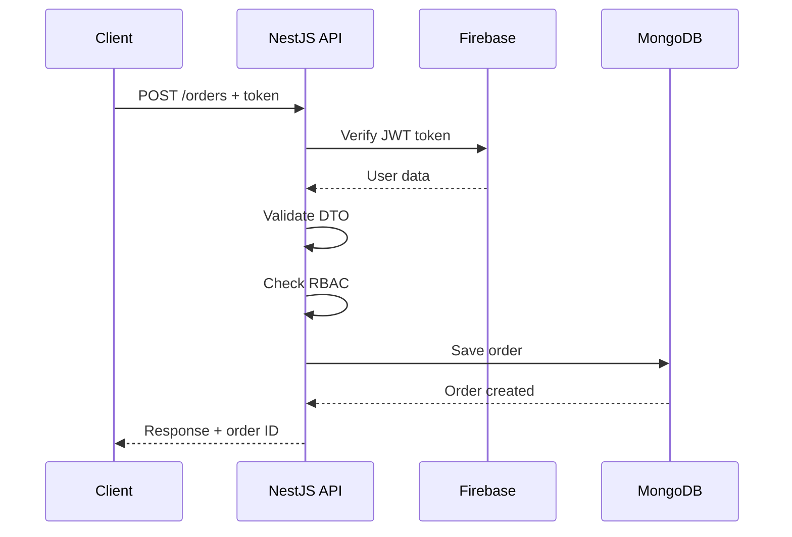
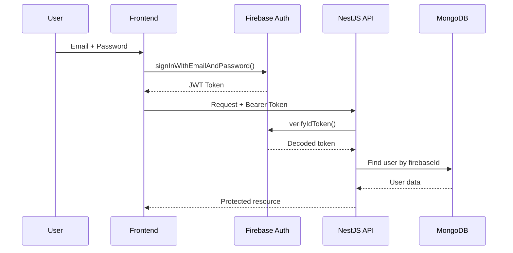

# 🏗️ Architecture - C2.2.3

## 1. Vue d'ensemble architecturale

### Philosophie
L'API Eatopia suit une **architecture modulaire NestJS** basée sur les principes :
- **Separation of Concerns** - Responsabilités distinctes par couche
- **Dependency Injection** - Couplage faible entre composants
- **Domain-Driven Design** - Organisation par domaine métier
- **Clean Architecture** - Indépendance des frameworks externes

### Stack technique
```typescript
// Technologies principales
Framework: NestJS 10.x (Node.js/TypeScript)
Database: MongoDB 8.x + Mongoose ODM
Authentication: Firebase Admin SDK
Documentation: Swagger/OpenAPI 3.0
Testing: Jest + Supertest
Deployment: Render + GitHub Actions
```

---

## 2. Architecture en couches

```
┌─────────────────────────────────────────────────────────┐
│                    🌐 HTTP Layer                        │
│  Controllers • Guards • Filters • Pipes • Interceptors │
├─────────────────────────────────────────────────────────┤
│                   💼 Business Layer                     │
│         Services • DTOs • Validation • Logic           │
├─────────────────────────────────────────────────────────┤
│                   📊 Data Layer                         │
│       Repositories • Models • Database Connections     │
├─────────────────────────────────────────────────────────┤
│                  🔧 Infrastructure                      │
│    Configuration • Utils • External APIs • Logging     │
└─────────────────────────────────────────────────────────┘
```

### 2.1 HTTP Layer (Présentation)
- **Controllers** - Endpoints REST API
- **Guards** - Authentification & autorisation
- **Filters** - Gestion globale des exceptions
- **Pipes** - Validation et transformation des données
- **Interceptors** - Logging et monitoring

### 2.2 Business Layer (Métier)
- **Services** - Logique métier de l'application
- **DTOs** - Objets de transfert de données
- **Validation** - Règles métier et contraintes
- **Domain Logic** - Règles spécifiques au restaurant

### 2.3 Data Layer (Données)
- **Repositories** - Abstraction d'accès aux données
- **Models** - Schémas MongoDB avec Mongoose
- **Connections** - Gestion des connexions DB
- **Migrations** - Évolution des schémas

### 2.4 Infrastructure Layer
- **Configuration** - Variables d'environnement
- **Utils** - Fonctions utilitaires partagées
- **External APIs** - Intégrations tierces (Firebase)
- **Logging** - Journalisation applicative

---

## 3. Structure des dossiers

```
src/
├── 📁 app.module.ts           # Module racine - Configuration globale
├── 📁 main.ts                 # Point d'entrée - Bootstrap application
├── 📁 configs/                # Configuration centralisée
│   ├── config.ts              # Variables d'environnement + validation
│   ├── firebase.config.ts     # Configuration Firebase Admin
│   └── swagger.config.ts      # Documentation OpenAPI
├── 📁 dto/                    # Data Transfer Objects
│   ├── user.dto.ts            # DTOs utilisateurs
│   ├── order.dto.ts           # DTOs commandes
│   ├── creation/              # DTOs de création
│   └── response/              # DTOs de réponse
├── 📁 guards/                 # Sécurité et contrôle d'accès
│   ├── firebase-token.guard.ts # Authentification Firebase
│   ├── roles.guard.ts         # Autorisation RBAC
│   └── roles.decorator.ts     # Décorateur @Roles
├── 📁 filters/                # Gestion des exceptions
│   └── global-exception.filter.ts # Filtre global d'erreurs
├── 📁 modules/                # Modules métier
│   ├── user/                  # Gestion utilisateurs
│   ├── dish/                  # Gestion plats
│   ├── order/                 # Gestion commandes
│   ├── card/                  # Gestion menus
│   ├── stock/                 # Gestion stocks
│   ├── ingredient/            # Gestion ingrédients
│   ├── table/                 # Gestion tables
│   └── health/                # Monitoring santé
├── 📁 mongo/                  # Couche données MongoDB
│   ├── models/                # Schémas Mongoose
│   ├── repositories/          # Repositories d'accès données
│   └── mongo.module.ts        # Configuration MongoDB
├── 📁 fixtures/               # Données de test
│   ├── fixtures.service.ts    # Service de génération
│   └── fixtures.module.ts     # Module fixtures
└── 📁 utils/                  # Utilitaires partagés
    ├── response.ts             # Format de réponse standardisé
    └── date.beautifier.ts      # Utilitaires de dates
```

---

## 4. Architecture des modules

### 4.1 Pattern de module standard
```typescript
// Structure type d'un module métier
@Module({
  imports: [
    MongooseModule.forFeature([
      { name: User.name, schema: UserSchema }
    ]),
  ],
  controllers: [UserController],      # HTTP Layer
  providers: [
    UserService,                      # Business Layer
    UserRepository,                   # Data Layer
  ],
  exports: [UserService],             # Services exposés
})
export class UserModule {}
```

### 4.2 Flux de données
```
HTTP Request
    ↓
Controller (validation, auth)
    ↓
Service (logique métier)
    ↓
Repository (accès données)
    ↓
MongoDB (persistance)
    ↓
Response (format standardisé)
```

### 4.3 Injection de dépendances
```typescript
// Exemple d'injection dans un service
@Injectable()
export class UserService {
  constructor(
    private readonly userRepository: UserRepository,  # Data access
    private readonly configService: ConfigService,    # Configuration
    private readonly logger: Logger,                  # Logging
  ) {}

  // Méthodes métier...
}
```

---

## 5. Modèles de données MongoDB

### 5.1 Schéma utilisateur
```typescript
@Schema()
export class User extends Document {
  @Prop({ required: true, unique: true, trim: true })
  email: string;

  @Prop({ select: false, required: true })  # Jamais exposé dans API
  firebaseId: string;

  @Prop({ required: true, trim: true })
  firstname: string;

  @Prop({ required: true, trim: true })
  lastname: string;

  @Prop({
    type: String,
    enum: Object.values(UserRole),
    required: true,
    default: UserRole.CUSTOMER,
  })
  role: UserRole;

  @Prop({ required: false, default: true })
  isActive: boolean;

  @Prop({
    type: String,
    required: true,
    default: DateBeautifier.shared.getFullDate(),
  })
  dateOfCreation: string;
}
```

### 5.2 Relations entre entités
```typescript
// Exemple de relation plat → ingrédients
@Schema()
export class Dish extends Document {
  @Prop({ required: true })
  name: string;

  @Prop([{
    ingredientId: { type: mongoose.Schema.Types.ObjectId, ref: 'Ingredient' },
    unity: { type: String, enum: Object.values(DishIngredientUnity) },
    quantity: { type: Number, required: true },
  }])
  ingredients: DishIngredient[];

  @Prop({ required: true, min: 0 })
  price: number;

  @Prop({
    type: String,
    enum: Object.values(DishCategory),
    required: true,
  })
  category: DishCategory;
}
```

### 5.3 Hooks et middleware MongoDB
```typescript
// Middleware automatique pour dates
UserSchema.pre('updateOne', function (next) {
  this.set({ dateLastModified: DateBeautifier.shared.getFullDate() });
  next();
});

UserSchema.pre('findOneAndUpdate', function (next) {
  this.set({ dateLastModified: DateBeautifier.shared.getFullDate() });
  next();
});
```

---

## 6. Architecture de sécurité

### 6.1 Chaîne d'authentification
```
1. Client → Token Firebase JWT
2. FirebaseTokenGuard → Validation token
3. Request.user → Injection utilisateur
4. RolesGuard → Vérification permissions
5. Controller → Exécution logique métier
```

### 6.2 Middleware de sécurité
```typescript
// Stack de sécurité dans main.ts
app.use(helmet());                    # Headers HTTP sécurisés
app.enableCors(corsConfig);           # Protection CORS
app.useGlobalPipes(validationPipe);   # Validation des données
app.useGlobalGuards(throttlerGuard);  # Rate limiting
app.useGlobalFilters(exceptionFilter); # Gestion d'erreurs
```

### 6.3 Validation en cascade
```typescript
// Pipeline de validation
1. ValidationPipe → Validation DTO (class-validator)
2. FirebaseTokenGuard → Authentification
3. RolesGuard → Autorisation RBAC
4. Business Logic → Validation métier
5. Repository → Validation base de données
```

---

## 7. Architecture des tests

### 7.1 Stratégie de test par couche
```typescript
// Tests par niveau architectural
Controllers:  Tests d'API (HTTP, validation, auth)
Services:     Tests de logique métier (mocking repositories)
Repositories: Tests d'accès données (MongoDB Memory Server)
Guards:       Tests de sécurité (auth, RBAC)
Utils:        Tests unitaires purs (fonctions)
```

### 7.2 Isolation des tests
```typescript
// Mocking des dépendances externes
jest.mock('firebase-admin');           # Firebase
jest.mock('mongoose');                 # MongoDB
jest.mock('../repositories/base.repository'); # Data access

// Test d'un service isolé
const mockRepository = {
  create: jest.fn(),
  findOne: jest.fn(),
  update: jest.fn(),
  delete: jest.fn(),
};
```

### 7.3 Tests d'intégration
```typescript
// Configuration module de test complet
const moduleRef = await Test.createTestingModule({
  imports: [
    MongooseModule.forRoot(getTestDatabaseUri()),
    UserModule,
  ],
  providers: [
    // Providers réels pour tests d'intégration
  ],
}).compile();
```

---

## 8. Patterns architecturaux

### 8.1 Repository Pattern
```typescript
// Abstraction d'accès aux données
export abstract class BaseRepository<T extends Document> {
  constructor(private readonly model: Model<T>) {}

  async create(data: any): Promise<T> {
    return this.model.create(data);
  }

  async findOneById(id: string): Promise<T | null> {
    return this.model.findById(id).exec();
  }

  // ... autres méthodes CRUD
}

// Implémentation spécifique
@Injectable()
export class UserRepository extends BaseRepository<User> {
  constructor(@InjectModel(User.name) userModel: Model<User>) {
    super(userModel);
  }

  // Méthodes spécifiques aux utilisateurs
  async findByEmail(email: string): Promise<User | null> {
    return this.model.findOne({ email }).exec();
  }
}
```

### 8.2 DTO Pattern
```typescript
// Validation et transformation des données
export class CreateUserDTO {
  @IsEmail()
  @IsNotEmpty()
  email: string;

  @IsString()
  @MinLength(1)
  firstname: string;

  @IsEnum(UserRole)
  @IsOptional()
  role?: UserRole = UserRole.CUSTOMER;
}

// Transformation automatique Controller → Service
@Post('users')
async createUser(@Body() userData: CreateUserDTO) {
  return this.userService.create(userData);  # DTO auto-transformé
}
```

### 8.3 Response Pattern
```typescript
// Format de réponse standardisé
export interface Response<T> {
  error: string;
  data: T | null;
}

// Usage dans tous les controllers
async findAll(): Promise<Response<User[]>> {
  const users = await this.userService.findAll();
  return { error: '', data: users };
}
```

---

## 9. Intégrations externes

### 9.1 Firebase Authentication
```typescript
// Architecture d'intégration Firebase
┌─────────────────┐    ┌─────────────────┐    ┌─────────────────┐
│   Frontend      │───▶│   Firebase      │───▶│   NestJS API    │
│   (Login UI)    │    │   (Auth Service)│    │   (Token Guard) │
└─────────────────┘    └─────────────────┘    └─────────────────┘
        │                        │                        │
        │ 1. Login/Password      │ 2. JWT Token          │ 3. Validated User
        │                        │                        │
        ▼                        ▼                        ▼
   User Session            Firebase Project         MongoDB User
```

### 9.2 MongoDB Atlas
```typescript
// Configuration de connexion sécurisée
const mongoConfig = {
  uri: process.env.MONGO_URL,
  options: {
    useNewUrlParser: true,
    useUnifiedTopology: true,
    ssl: true,                    # Chiffrement transport
    authSource: 'admin',
    retryWrites: true,
    w: 'majority',               # Write concern sécurisé
    maxPoolSize: 10,             # Pool de connexions
    serverSelectionTimeoutMS: 5000,
    socketTimeoutMS: 45000,
  },
};
```

### 9.3 Render Platform
```typescript
// Configuration déploiement cloud
const renderConfig = {
  buildCommand: 'npm run build',
  startCommand: 'npm run start:prod',
  healthCheckPath: '/health',
  environment: {
    NODE_ENV: 'production',
    PORT: '10000',  # Auto-configuré
  },
  scaling: {
    minInstances: 1,
    maxInstances: 3,
    autoscaling: true,
  },
};
```

---

## 10. Flux de données

### 10.1 Création d'une commande


### 10.2 Authentification utilisateur


---

## 11. Gestion des erreurs

### 11.1 Architecture d'exception
```typescript
// Hiérarchie des exceptions
HttpException
├── BadRequestException (400)
├── UnauthorizedException (401)
├── ForbiddenException (403)
├── NotFoundException (404)
└── InternalServerErrorException (500)

// Filtre global d'exceptions
@Catch()
export class GlobalExceptionFilter implements ExceptionFilter {
  catch(exception: unknown, host: ArgumentsHost) {
    const ctx = host.switchToHttp();
    const response = ctx.getResponse();

    const status = exception instanceof HttpException
      ? exception.getStatus()
      : HttpStatus.INTERNAL_SERVER_ERROR;

    response.status(status).json({
      statusCode: status,
      timestamp: new Date().toISOString(),
      path: ctx.getRequest().url,
      message: this.getErrorMessage(exception),
    });
  }
}
```

### 11.2 Propagation des erreurs
```
Database Error
    ↓
Repository (catch + transform)
    ↓
Service (business validation)
    ↓
Controller (HTTP status)
    ↓
Global Filter (format response)
    ↓
Client (structured error)
```

### 11.3 Logging des erreurs
```typescript
// Logging contextuel par niveau
export class ErrorLogger {
  logError(error: Error, context: string, metadata?: any) {
    this.logger.error(`[${context}] ${error.message}`, {
      stack: error.stack,
      metadata,
      timestamp: new Date().toISOString(),
      environment: process.env.NODE_ENV,
    });
  }
}
```

---

## 12. Performance et scalabilité

### 12.1 Optimisations MongoDB
```typescript
// Indexes pour performance
UserSchema.index({ email: 1 }, { unique: true });
OrderSchema.index({ tableNumberId: 1, dateOfCreation: -1 });
DishSchema.index({ category: 1, isAvailable: 1 });

// Pagination automatique
export class PaginationDTO {
  @IsOptional()
  @Type(() => Number)
  @Min(1)
  page?: number = 1;

  @IsOptional()
  @Type(() => Number)
  @Min(1)
  @Max(100)
  limit?: number = 20;
}
```

### 12.2 Cache et optimisations
```typescript
// Cache Redis (optionnel pour scaling)
@Injectable()
export class CacheService {
  async get<T>(key: string): Promise<T | null> {
    const cached = await this.redis.get(key);
    return cached ? JSON.parse(cached) : null;
  }

  async set<T>(key: string, value: T, ttl: number = 3600): Promise<void> {
    await this.redis.setex(key, ttl, JSON.stringify(value));
  }
}
```

### 12.3 Rate Limiting architectural
```typescript
// Configuration multicouche
const rateLimitConfig = [
  {
    name: 'short',
    ttl: 10000,    # 10 secondes
    limit: 100,    # Burst protection
  },
  {
    name: 'medium',
    ttl: 60000,    # 1 minute
    limit: 1000,   # Usage normal
  },
  {
    name: 'long',
    ttl: 3600000,  # 1 heure
    limit: 10000,  # Limite quotidienne
  },
];
```

---

## 13. Évolutivité et maintenance

### 13.1 Ajout de nouveaux modules
```typescript
// Template pour nouveau module
1. Créer le modèle MongoDB
   src/mongo/models/nouveau.model.ts

2. Créer le repository
   src/mongo/repositories/nouveau.repository.ts

3. Créer les DTOs
   src/dto/nouveau.dto.ts
   src/dto/response/nouveau.response.dto.ts

4. Créer le service
   src/modules/nouveau/nouveau.service.ts

5. Créer le controller
   src/modules/nouveau/nouveau.controller.ts

6. Créer le module
   src/modules/nouveau/nouveau.module.ts

7. Ajouter dans app.module.ts
```

### 13.2 Migration de schémas
```typescript
// Script de migration MongoDB
export class MigrationService {
  async migrateToV2() {
    // Exemple: Ajout d'un champ
    await this.userModel.updateMany(
      { version: { $exists: false } },
      { $set: { version: 2, newField: 'defaultValue' } }
    );
  }
}
```

### 13.3 Versioning API
```typescript
// Gestion des versions d'API
@Controller({ version: '1' })  # /v1/users
export class UserV1Controller { ... }

@Controller({ version: '2' })  # /v2/users
export class UserV2Controller { ... }

// Configuration globale
app.enableVersioning({
  type: VersioningType.URI,
  prefix: 'v',
});
```

---

## 14. Monitoring et observabilité

### 14.1 Health checks détaillés
```typescript
@Get('health')
async getHealth(): Promise<HealthStatus> {
  return {
    status: 'ok',
    timestamp: new Date().toISOString(),
    uptime: process.uptime(),
    environment: process.env.NODE_ENV,
    version: process.env.npm_package_version,

    // Vérifications des dépendances
    dependencies: {
      mongodb: await this.checkMongoDB(),
      firebase: await this.checkFirebase(),
      memory: process.memoryUsage(),
      cpu: process.cpuUsage(),
    },
  };
}
```

### 14.2 Métriques applicatives
```typescript
// Collecte de métriques custom
export class MetricsService {
  private readonly counters = new Map<string, number>();

  incrementCounter(name: string, labels?: Record<string, string>) {
    const key = this.buildKey(name, labels);
    this.counters.set(key, (this.counters.get(key) || 0) + 1);
  }

  // Métriques exposées sur /metrics
  getMetrics(): Record<string, number> {
    return Object.fromEntries(this.counters);
  }
}
```

### 14.3 Tracing distribué
```typescript
// Configuration OpenTelemetry (optionnel)
if (process.env.TRACING_ENABLED === 'true') {
  const tracing = require('@opentelemetry/auto-instrumentations-node');
  tracing.getNodeAutoInstrumentations({
    '@opentelemetry/instrumentation-fs': { enabled: false },
  });
}
```

---

## 15 Évolution prévue
```typescript
// Roadmap architectural
Phase 1: API REST monolithique (actuel)
Phase 2: Microservices (si scaling nécessaire)
Phase 3: Event-driven architecture (notifications temps réel)
Phase 4: CQRS + Event Sourcing (audit complet)
```
